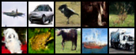

# cifar10-flow-matching
I implemented and trained a flow model on cifar10 to generate images given a class label with classifier-free guidance. I did this just for the learning experience and it should not be taken very seriously. Here are some images my model generated:

I generated an image for each class: (airplane, 0), (automobile, 1), (bird, 2), (cat, 3), (deer, 4), (dog, 5), (frog, 6), (horse, 7), (ship, 8), (truck, 9). This was just my first completed training run without tuning any hyperparameters or inference settings. It's not perfect and should be easy to improve. I didn't compute FID for the model I trained, but I'm satisfied that it produces images that look close enough to real cifar10 images from the appropriate class label. If I were taking this more seriously, I would also visually examine how similar generated images are to their nearest neighbors in the training set (w.r.t. L2 norm) to see if my model overfit. I didn't tune the training hyperparameters or how inference was done. I just used a CFG weight of 4 and did 100 steps of forward euler to generate samples. If I were to play around with this code some more, I'd want to compute FID for different combinations of the CFG weight and number of forward Euler steps. Also I would want to play around with different numerical integration approaches to see how they impact image quality. Also I forgot to do any data augmentation (e.g. horizontal flips) for training, so that's another thing I'd add if I were to revisit this repo.

I implemented a U-Net architecture from scratch where I made some personal choices rather than blindly copying existing implementations, I do not claim that the choices I made were optimal. I wrote a lot of comments in `model.py` that show my thought process and explain how basic components of the architecture work.

I wrote some high-level notes about why the training approach works in `train.py` to help me organize my thoughts and internalize important details. 

I didn't bother with actual diffusion models (i.e. using an SDE rather than an ODE) because it is pretty trivial to extend my flow model to a diffusion model because 1) you can use fokker-planck to show that adding a diffusion term (to go from ODE to SDE) preserves the trajectory marginals p_t so long as you add an appropriate correction term to your drift and this correction term can be written in terms of the score function (the gradient of log(p_t)) and 2) for Gaussian probability paths (which I used) you can derive a simple relationship between the score and the vector field such that if you learn one of them you can easily get the other. Maybe I'll implement this at some point, but I have more interesting things I want to do and I've already learned most of what I wanted to learn from coding this up
